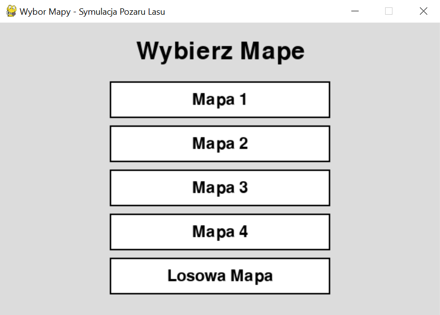
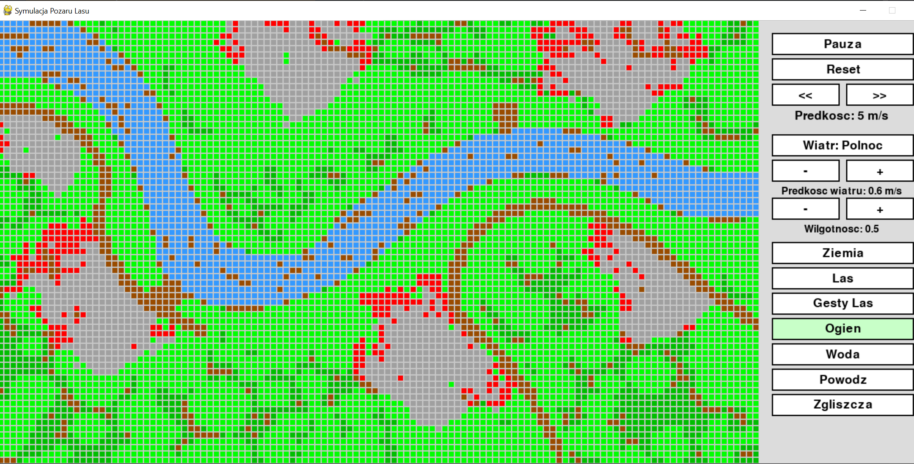
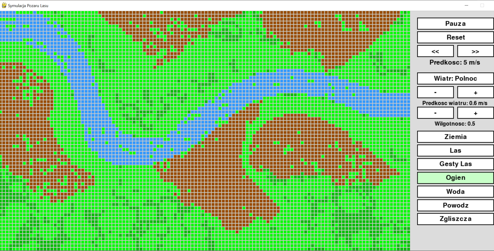

# 🔥 DiscreteModelingForestFire

> **PL** | Symulacja pożaru lasu oparta na automatach komórkowych z uwzględnieniem wiatru, wilgotności i rzeźby terenu.
>
> **EN** | Cellular automaton-based forest fire simulation with wind direction, humidity and terrain elevation effects.

---

## 🇵🇱 Opis projektu

Projekt realizuje **dyskretne modelowanie pożaru lasu** przy użyciu automatów komórkowych (CA). Każda komórka siatki reprezentuje fragment terenu i może przyjmować jeden z siedmiu stanów — od pustego gruntu, przez różne fazy lasu, aż po ogień i zgliszcza. Przejścia między stanami są deterministyczne (z elementem losowości dla realizmu) i zależą od sąsiedztwa komórki, kierunku oraz prędkości wiatru, wilgotności terenu i wysokości nad poziomem morza.

Mapa startowa może być wczytana z obrazu PNG (kolory pikseli są mapowane na stany) lub wygenerowana losowo. Symulację obsługuje silnik graficzny **pygame**.

## 🇬🇧 Project Description

The project implements **discrete forest fire modelling** using cellular automata (CA). Each grid cell represents a terrain patch and can be in one of seven states — from empty ground, through different forest growth stages, to active fire and ash. State transitions are deterministic (with a stochastic component for realism) and depend on the cell neighbourhood, wind direction and speed, terrain humidity, and elevation.

The initial map can be loaded from a PNG image (pixel colours are mapped to states) or generated randomly. Rendering is powered by **pygame**.

---

## 🌲 Stany komórek / Cell States

| Stan / State | Symbol | Opis / Description |
|---|---|---|
| `PUSTY` | ⬛ | Goła ziemia → odrasta w las / Bare ground → regrows |
| `LAS` | 🟢 | Młody las (łatwo płonie) / Young forest (burns easily) |
| `LAS_GESTY` | 🟩 | Gęsty las (płonie 6× dłużej) / Dense forest (burns 6× longer) |
| `OGIEN` | 🔴 | Płonący teren / Active fire |
| `SPALONY` | ⬜ | Zgliszcza → regeneracja / Ash → regeneration |
| `WODA` | 🔵 | Rzeka/jezioro — stan stały / River/lake — permanent |
| `POWODZ` | 💧 | Zalany teren → wraca do pustego / Flooded → returns to empty |

---

## ✨ Funkcje / Features

| 🇵🇱 | 🇬🇧 |
|-----|-----|
| 7 stanów komórek z realistycznymi przejściami | 7 cell states with realistic transitions |
| 9 kierunków wiatru (N, S, E, W, NE, NW, SE, SW, brak) | 9 wind directions (+ no wind) |
| Regulowana prędkość wiatru i wilgotność (0–1) | Configurable wind speed and humidity (0–1) |
| Wczytywanie mapy z pliku PNG | Map loading from PNG image |
| 4 gotowe mapy terenu | 4 predefined terrain maps |
| Losowe generowanie mapy | Random map generation |
| Rzeźba terenu wpływa na kierunek ognia | Terrain elevation affects fire spread |
| Wizualizacja w czasie rzeczywistym (pygame) | Real-time visualization (pygame) |

---

## 🌬️ Model wiatru / Wind Model

Kierunek wiatru wpływa na prawdopodobieństwo przeniesienia ognia:

```
Zgodny z wiatrem    →  p = 0.90  (najwyższe)
Równoległy          →  p = 0.70
Neutralny (brak w.) →  p = 0.10
Przeciwny do wiatru →  p = 0.05  (najniższe)
```

---

## 🛠️ Technologie / Tech Stack


```
pygame   — silnik wizualizacji i interfejsu
numpy    — operacje na siatce
Pillow   — wczytywanie i skalowanie map PNG
enum     — definicja stanów komórek
```

---

## 🚀 Uruchomienie / Getting Started

### Wymagania / Requirements
```bash
pip install pygame numpy Pillow
```

### Start
```bash
python Main.py
```

Po uruchomieniu pojawi się menu wyboru mapy. Kliknij na wybrany scenariusz, ustaw parametry (wiatr, wilgotność) i kliknij lewym przyciskiem myszy na wybraną komórkę, aby podpalić las.

---

## 📁 Struktura projektu / Project Structure

```
DiscreteModelingForestFire/
│
├── Main.py           # Punkt wejścia, wczytywanie map, główna pętla / Entry point
├── Automaton.py      # Logika automatu komórkowego, stany, przejścia / CA logic
├── Visualization.py  # Renderowanie pygame, UI / pygame rendering & UI
└── Obrazy/           # Mapy terenu w formacie PNG / Terrain maps (PNG)
    ├── forest1.png
    ├── forest2.png
    ├── forest3.png
    └── forest4.png
```

---

## 🗺️ Format mapy PNG / Map PNG Format

Kolory pikseli są interpretowane następująco:

```
Niebieski (B dominuje)       →  WODA
Zielony jasny (G > 100)      →  LAS (młody)
Zielony ciemny (G ≤ 100)     →  LAS_GESTY (stary)
Pozostałe kolory             →  PUSTY (ziemia)
```

## 📸 Zrzuty ekranu / Screenshots


 
 

---

## 👩‍💻 Autorka / Author

**Julianna Wachowicz**
[github.com/JuliannaWach](https://github.com/JuliannaWach)
